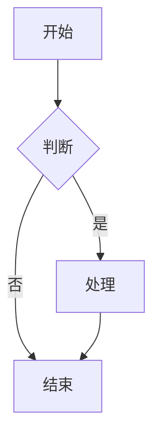
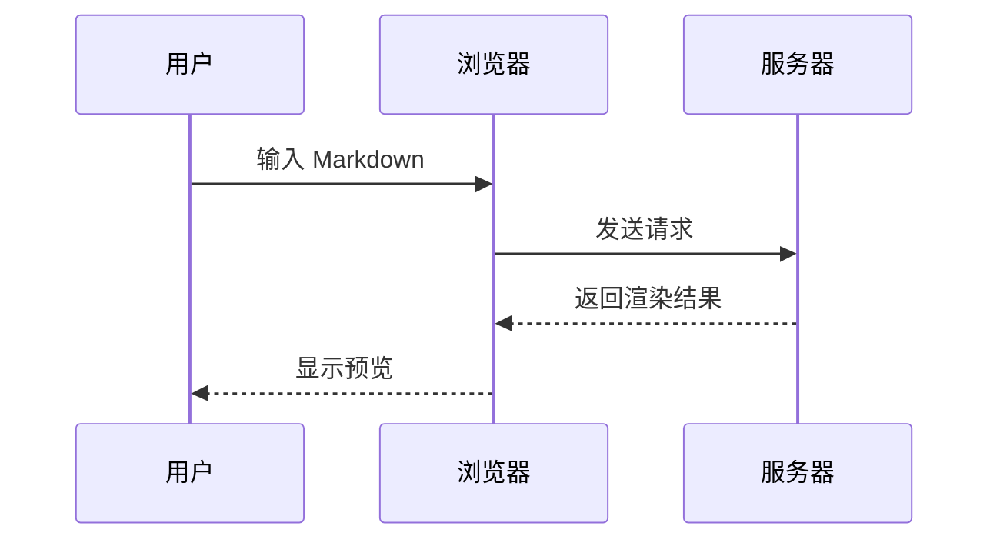
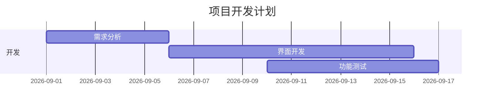

# 墨页完整语法测试文件

> **目的**：测试 Markdown 渲染器的完整性、性能和视觉效果  
> **建议**：用这个文件进行压力测试 + 视觉检查

> [!NOTE]
> 这是 GitHub 风格的说明块。Agent 文档里很常见。

> [!TIP]
> 目录、代码折叠和阅读纸面是这篇阅读器的重点。

> [!WARNING]
> 超长代码块默认折叠，避免把阅读节奏打断。

> [!CAUTION]
> 公式、图表和表格会按语义着色，而不是一堆黑字。

---

## 1. 标题层级测试

# H1 - 一级标题
## H2 - 二级标题
### H3 - 三级标题
#### H4 - 四级标题
##### H5 - 五级标题
###### H6 - 六级标题

---

## 2. 段落与文本格式

这是一个普通的段落。Markdown 支持**加粗**、*斜体*、***加粗加斜体***、~~删除线~~。

还可以使用 `行内代码` 来标记代码片段。

支持下标：H~2~O  
支持上标：E = mc^2^

---

## 3. 列表

### 无序列表

- 项目一
- 项目二
  - 子项目 A
  - 子项目 B
    - 更深层
- 项目三

### 有序列表

1. 第一步
2. 第二步
   1. 子步骤 2.1
   2. 子步骤 2.2
3. 第三步

### 任务列表（Task List）

- [x] 已完成的任务
- [ ] 未完成的任务
- [x] 另一个已完成项
- [ ] 待办事项

---

## 4. 链接与图片

### 链接

- [普通链接](https://github.com)
- [带标题的链接](https://github.com "GitHub 官网")
- 自动链接：<https://www.google.com>

### 图片


带链接的图片：

[](https://github.com)

---

## 5. 引用块

> 这是一个简单的引用。
>
> > 这是嵌套引用
> > 可以有多层

> **重要提示**  
> 引用块里也可以使用 **加粗** 和 `代码`。

---

## 6. 代码块

### 行内代码

使用 `console.log()` 输出内容。

### 带语言的代码块

```javascript
function greet(name) {
  console.log(`Hello, ${name}!`);
}

greet("World");
```

```python
def fibonacci(n):
    if n <= 1:
        return n
    return fibonacci(n-1) + fibonacci(n-2)

print(fibonacci(10))
```

```bash
# 安装依赖
npm install

# 启动开发服务器
npm run dev
```

```json
{
  "name": "md-viewer",
  "version": "0.1.0",
  "dependencies": {
    "react": "^19.1.0"
  }
}
```

---

## 7. 表格

| 功能         | 状态     | 优先级 | 备注                  |
|--------------|----------|--------|-----------------------|
| 基础渲染     | ✅ 已完成 | 高     | GFM 语法              |
| 数学公式     | ✅ 已完成 | 高     | KaTeX 支持            |
| Mermaid 图表 | ✅ 已完成 | 中     | 流程图、时序图等      |
| 代码高亮     | ✅ 已完成 | 高     | 多种语言              |
| 导出 PDF     | ⏳ 开发中 | 中     | 待实现                |
| 图片拖拽     | ⏳ 开发中 | 低     | 计划中                |

右对齐示例：

| 右对齐 | 居中 | 左对齐 |
|:------:|:----:|--------|
|  123   |  ABC | 文本   |

---

## 8. 水平分割线

---

***

___

---

## 9. 数学公式（KaTeX）

### 行内公式

爱因斯坦质能方程：$E = mc^2$

勾股定理：$a^2 + b^2 = c^2$

### 块级公式

$$
\int_{-\infty}^{\infty} e^{-x^2} dx = \sqrt{\pi}
$$

矩阵示例：

$$
\begin{pmatrix}
a & b \\
c & d
\end{pmatrix}
$$

---

## 10. Mermaid 图表

### 流程图



### 时序图



### 甘特图



---

## 11. 脚注（Footnotes）

这是一个带脚注的句子[^1]。

另一个脚注示例[^footnote]。

[^1]: 这是第一个脚注的内容。
[^footnote]: 这是第二个脚注，可以写比较长的解释。

---

## 12. 原始 HTML（部分支持）

<div style="padding: 12px; background: #fef3c7; border-radius: 8px;">
  <strong>注意：</strong> 这是一个 HTML 块。
</div>

---

## 13. 强调与特殊语法

- **加粗**
- *斜体*
- ***加粗 + 斜体***
- ~~删除线~~
- ==高亮== （部分渲染器支持，GFM 标准不支持）
- `行内代码`

自动链接：https://github.com

---

## 14. 嵌套复杂结构

> ### 嵌套在引用里的标题
>
> - 列表项 1
> - 列表项 2
>   ```js
>   console.log("在引用里的代码");
>   ```
>
> | 嵌套表格 | 测试 |
> |----------|------|
> | 内容     | 123  |

---

## 15. 长文本压力测试

Lorem ipsum dolor sit amet, consectetur adipiscing elit. Sed do eiusmod tempor incididunt ut labore et dolore magna aliqua. Ut enim ad minim veniam, quis nostrud exercitation ullamco laboris nisi ut aliquip ex ea commodo consequat.

重复段落测试（用于测试长文档滚动性能）：

Lorem ipsum dolor sit amet, consectetur adipiscing elit. Sed do eiusmod tempor incididunt ut labore et dolore magna aliqua. Ut enim ad minim veniam, quis nostrud exercitation ullamco laboris nisi ut aliquip ex ea commodo consequat. Duis aute irure dolor in reprehenderit in voluptate velit esse cillum dolore eu fugiat nulla pariatur.

（以上内容可复制多段测试大文档渲染）

---

## 16. 特殊字符与 Emoji

支持 Emoji：🚀 ✅ 🔥 📝 🎯

特殊符号：© ® ™ € ¥ → ← ↑ ↓

---

**测试完成提示**：

请使用此文件测试以下功能：

- [ ] 所有标题层级是否清晰
- [ ] 代码块高亮是否正常
- [ ] Mermaid 图表是否渲染
- [ ] 数学公式是否显示
- [ ] 表格对齐与样式
- [ ] 引用块视觉区分
- [ ] 大段落滚动是否流畅
- [ ] 深色/浅色主题切换效果

祝测试愉快！